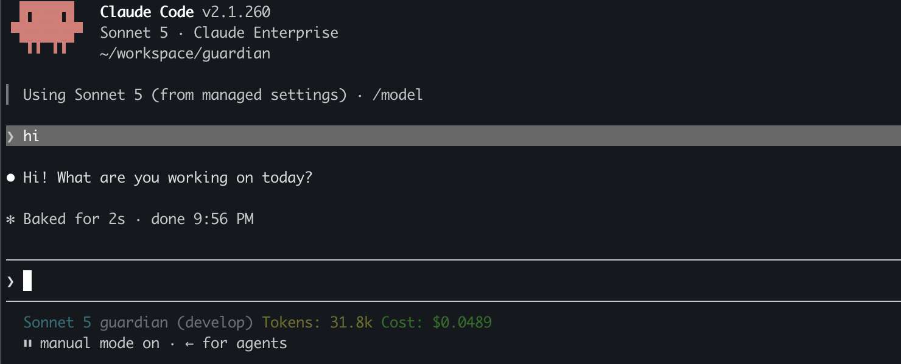

# Custom Claude Code Settings

Customize Claude Code settings — status line first — and keep those customizations from
being silently dropped.



Claude Code owns `settings.json` in its config dir (`~/.claude` by default) and
rewrites it on its own; keys you add by hand can disappear. So this repo has two halves:

- **customizations** (`customizations/`) — what you want Claude Code to look
  like. Each one is a directory with a settings fragment plus any executables
  and resources it needs.
- **enforcement** (`enforcement/`) — a small watchdog (`launchd` on macOS,
  `systemd --user` on Linux) that deep-merges those fragments (combined at
  install time into a single `settings.enforced.json`) back into
  `settings.json` whenever it drifts. A utility, not the point.

## Customizations in this repo

| Customization | Depends on | What it does |
| -------------- | ---------- | ------------ |
| `claude-session-info` | `statusline` | Model, cwd, git branch, context-window tokens, session cost |
| `clear-context-on-plan-accept` | — | Offer to clear context when a plan is accepted |
| `hbar-addicted` | `statusline` | HBAR/USD price, 1h/24h change, last update time |
| `no-attribution` | — | Strip Claude attribution from commits/PRs |
| `statusline` | — | Status line host: renders segments contributed by other customizations, in order |

`scripts/status.sh` prints this same catalog with each one's install state.
`statusline` alone renders nothing — install `claude-session-info` and/or
`hbar-addicted` (or write your own) to actually see something. Why it's split
this way, how a segment is built, and the manifest/stdin/stdout contract for
writing your own: [`customizations/statusline/docs/statusline-segments.md`](customizations/statusline/docs/statusline-segments.md).

## Install

```bash
scripts/install-or-update.sh claude-session-info  # this one, plus whatever it requires
                                                  # or
scripts/install-or-update.sh                      # every customization
```

Naming customizations installs those (and their dependencies — see
`customizations/README.md`) *in addition to* whatever's already installed;
it's a union, not a replacement. Use `scripts/uninstall.sh` to shrink the set.

### Which config directory

Every script in `scripts/` decides which Claude Code config directory to manage:

1. **`CLAUDE_CONFIG_DIR`** (Claude Code's own variable) or `CLAUDE_DIR` (which
   wins) is set: only that directory, no question asked. This is also how to
   target a directory from a non-interactive context:

   ```bash
   CLAUDE_CONFIG_DIR=~/.secure-ai/claude-code/config scripts/install-or-update.sh
   ```

2. **Otherwise, whatever exists** among `~/.claude` and the config directory of
   the [secure-ai](https://github.com/Neurone/secure-ai) sandbox,
   `~/.secure-ai/claude-code/config`: the script runs for each one found, with the
   same arguments (`scripts/install-or-update.sh hbar-addicted` customizes both).
   If one of them fails the other is still processed, and the exit status is
   non-zero.

3. **Neither exists**: `install-or-update.sh` asks, when run interactively
   (the other scripts just use `~/.claude`),

   ```text
   Claude Code config dir [~/.claude]:
   ```

   Press Enter for `~/.claude`, or type an absolute path (a leading `~` is
   expanded). Without a terminal it uses `~/.claude`.

Each config directory gets its own install under
`<config dir>/customizations/custom-claude-code-settings`. Only `~/.claude`, the
native Claude Code config directory, gets the watchdog service. Every other
directory (secure-ai's included) gets **no watchdog**: nothing there rewrites
`settings.json`, so the customizations are applied once at install time and that's
it (`status.sh` says so instead of reporting a missing service). To manage just
one of two existing directories, use `CLAUDE_CONFIG_DIR`. `scripts/logs.sh -f`
follows only the first directory's logs; pick one with `CLAUDE_CONFIG_DIR`.

Requires `jq` (1.6 or newer), `python3`, and macOS or Linux; the status line
segments also use `git` (`claude-session-info`) and `curl` (`hbar-addicted`). On Linux, if no `systemd --user`
manager is available (common in containers), the customizations are still installed and enforced once;
you just don't get the always-on watchdog. See `enforcement/README.md` for
what that degradation looks like and how to keep a user manager alive on a
headless box. Re-run the installer after editing or adding a customization.

## Day to day

```bash
scripts/status.sh                         # catalog + install state, watchdog loaded?, settings drifted?
scripts/logs.sh -f                        # watch the watchdog
scripts/logs.sh hbar-addicted             # watch one customization's own logs instead
scripts/enforce-now.sh                    # re-apply right now
scripts/uninstall.sh                      # stop enforcing everything installed and undo it in settings.json
scripts/uninstall.sh claude-session-info  # undo only the named customization(s)
```

Removing a customization still required by another installed one fails with
the list of dependents instead of cascading — `scripts/uninstall.sh` tells
you the command to remove both.

Every installed customization gets its own `<install-dir>/logs/<name>/` and
`<install-dir>/cache/<name>/` (the watchdog's own `enforce.log` stays at
`<install-dir>/logs/enforce.log`, not being a customization itself);
`scripts/uninstall.sh` removes both when the customization goes.

## Adding a customization

```bash
mkdir -p customizations/my-thing
cat > customizations/my-thing/customization.json <<'JSON'
{ "someSetting": true }
JSON
scripts/install-or-update.sh
```

Executables go in `customizations/my-thing/bin/` and are referenced from the
fragment as `@@BIN_DIR@@/<file>`; see `customizations/README.md` for the full
list of placeholders.

## How enforcement behaves

- Only enforced keys are touched — everything else in `settings.json` is kept.
- The file is rewritten only when the merge result actually differs, and always
  atomically (temp file + rename).
- An unparseable (or non-object) `settings.json` is never rewritten: it's left
  exactly as-is, a copy is saved to
  `<install-dir>/backups/settings.json.broken-<timestamp>` for forensics, and
  the reason is logged.
- Triggers: on `settings.json` or `settings.enforced.json` changing on disk
  (`WatchPaths` on launchd, a `.path` unit on systemd), at load/start, plus a
  5-minute safety net.

## Caveat

Managed (enterprise) settings win over user settings, so a key pinned by a
managed policy cannot be overridden here — the enforcer will keep writing it
and Claude Code will keep ignoring it.

## Tests

```bash
scripts/test-all.sh   # everything below, plus the same suite run on Linux via Docker
```

Or individually:

```bash
python3 -m unittest discover tests    # dependency resolution, config dir and placeholder rendering, config dir selection, watchdog scope, install hooks, script failure handling, statusline segments, hbar price history, the enforcement utility, test environment isolation
scripts/shellcheck.sh
```

These source `lib/common.sh` and run the individual scripts (fetchers,
segments, the statusline host, the maintenance scripts) against disposable
temp directories and fixtures. `install-or-update.sh`/`uninstall.sh` only ever
run with a throwaway `HOME` and either `launchctl`/`systemctl` replaced by
stubs on `PATH` or a config dir that gets no service, so the real launchd/systemd
service is never touched.

`scripts/test-all.sh` runs the commands above natively (only when this host
is macOS) and always additionally runs `scripts/test-linux.sh` — the same
suite plus install/uninstall verification, run inside disposable Linux
containers via Docker, which is how macOS/BSD-vs-Linux/GNU differences (the
kind that only show up in `stat`, `date`, locale-dependent string length,
`jq` version behavior, etc.) actually get caught. Requires Docker for the
install/uninstall verification; the test suite itself also runs without
Docker when the host is already Linux — it just runs directly on that host
instead of inside a disposable container. Either way the tests run the scripts
with a throwaway `HOME` and without `XDG_CONFIG_HOME` (which a desktop session
sets and which would otherwise redirect the systemd user units to the real
`~/.config/systemd/user`); see `tests/sandbox_env.py`.