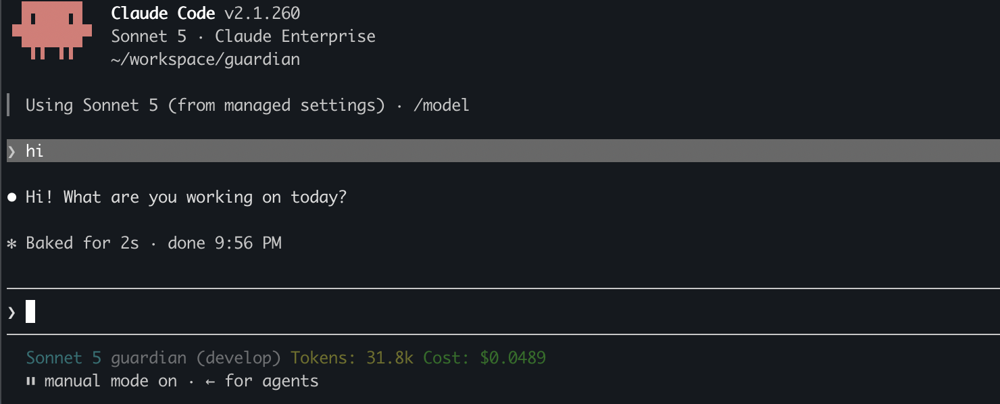

# Status Line (host)

Owns the `statusLine` key in `settings.json` but renders nothing on its own.
It collects the *segments* declared by other customizations (each a
`resources/statusline-segment.json` manifest plus an executable), sorts them
by `order`, and joins the non-empty ones with a dim ` │ ` separator.

Installing `statusline` alone gives you an **empty status line** — install a
segment customization such as `claude-session-info` to get the line back
that this repo used to hard-code.

- `bin/statusline-command.sh` — the host/renderer (needs `jq`)
- `customization.json` — the `statusLine` settings fragment

Full contract for writing a segment (manifest schema, stdin payload, stdout
rules, error handling, where segments keep logs/cache): see
[`docs/statusline-segments.md`](docs/statusline-segments.md).

